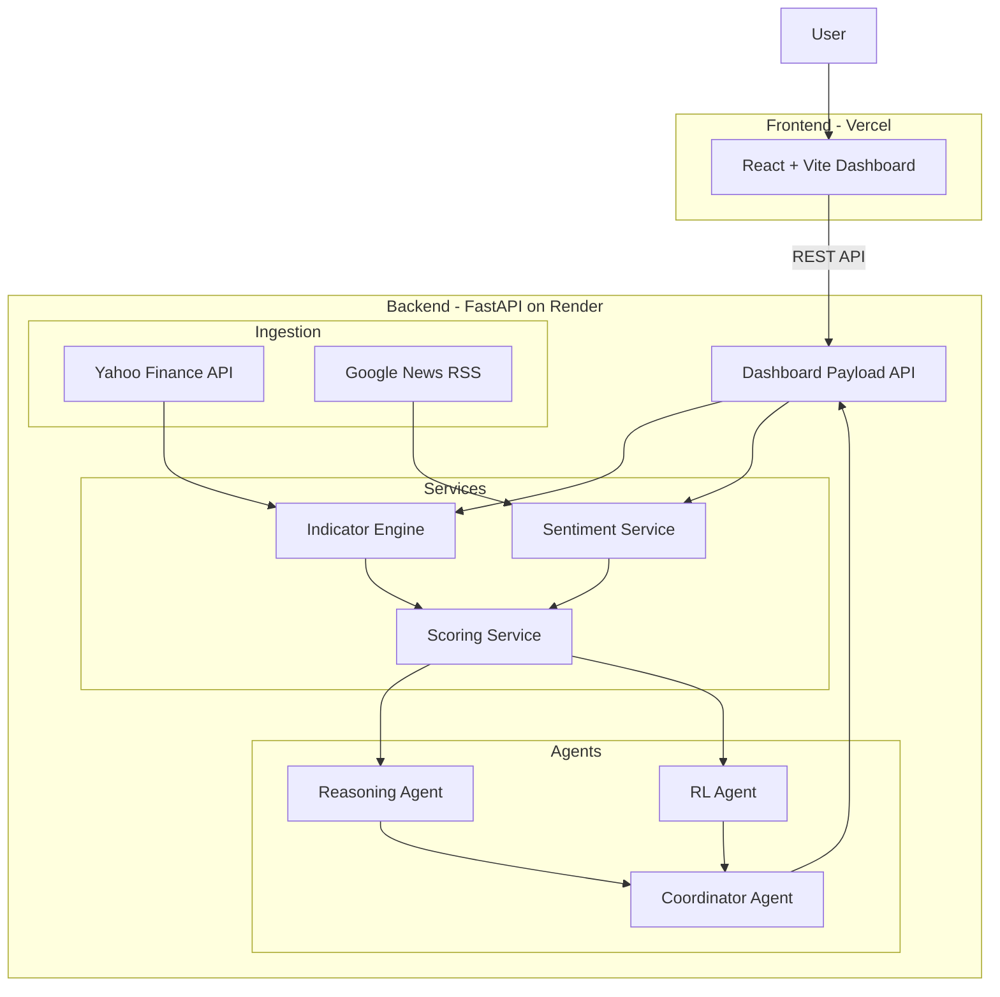
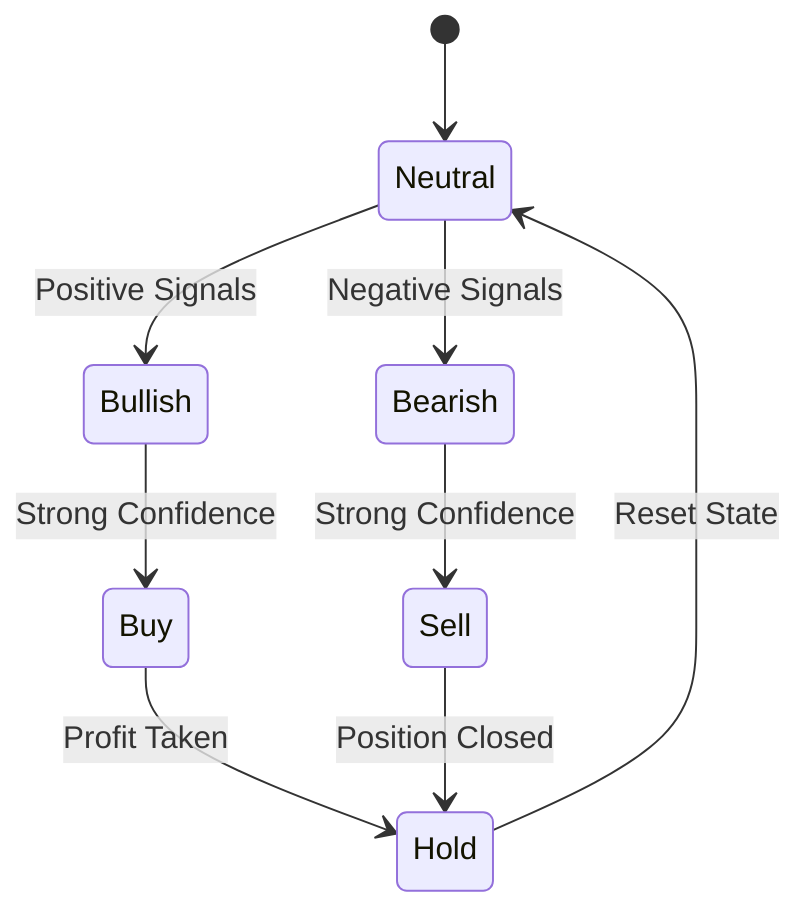
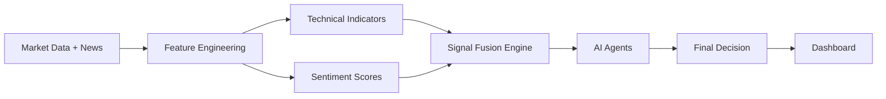
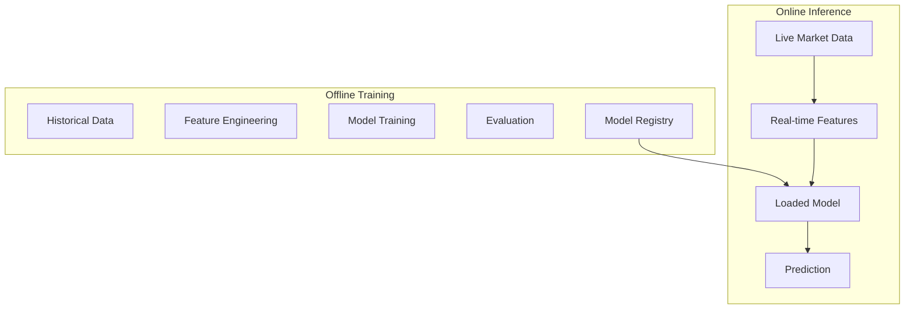
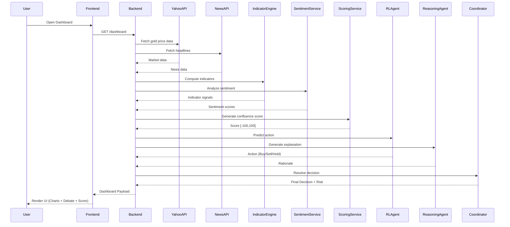
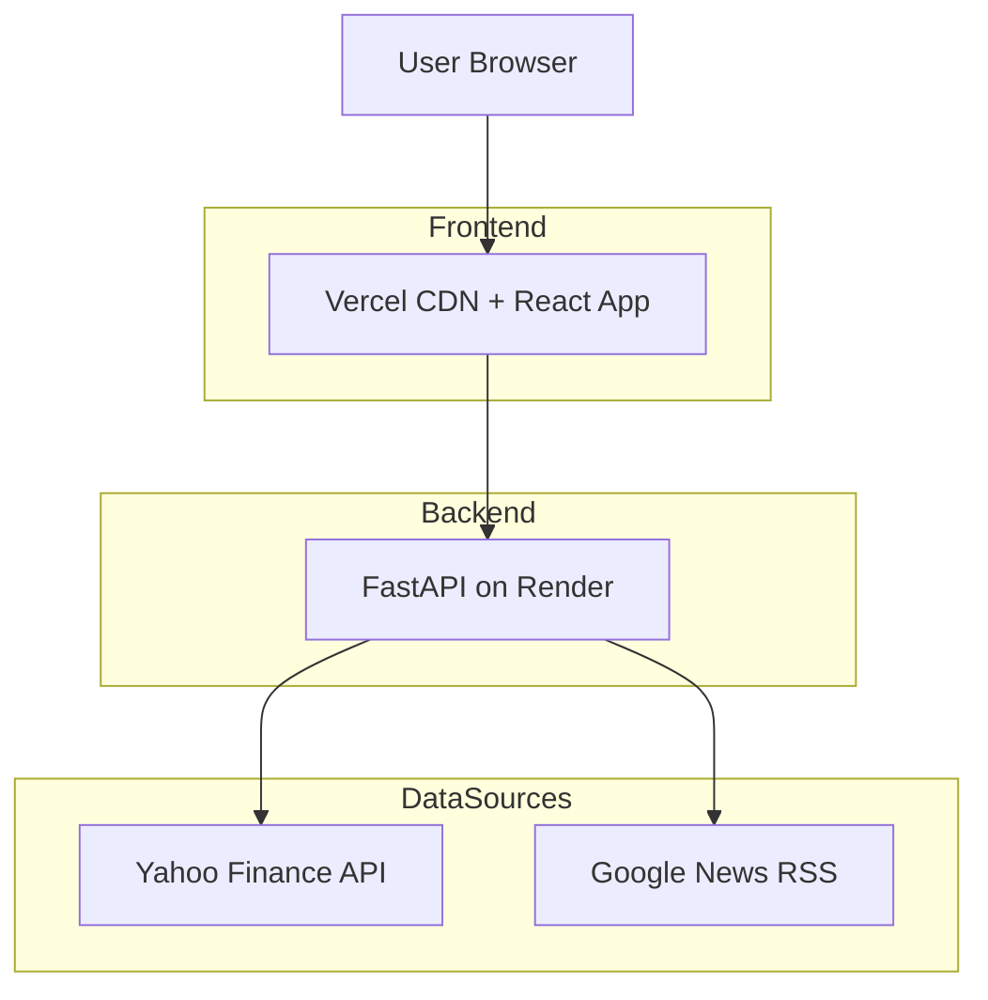

# 🔱 GoldHelm AI

**GoldHelm AI** is a production-grade multi-agent financial intelligence platform designed for next-day gold futures forecasting and explainable trading decision support. It bridges the gap between deep machine learning signals and human-readable market context.

---

## 🏗️ System Architecture

GoldHelm follows a decoupled, cloud-native architecture optimized for real-time inference and explainable outputs.



---

## 🧠 The Intelligence Stack

### 1. Multi-Agent Orchestration
GoldHelm doesn't just return a raw number; it hosts a "Debate" between three distinct AI agents to reach a final consensus:

*   **Reasoning Agent:** A deterministic logical engine that processes technical signals into human-readable rationales.
*   **RL Policy Agent:** A Q-Learning agent trained on rewards (profit/loss) that suggests an optimal trading action based on the current market state.
*   **Coordinator Agent:** The final decision-maker. It evaluates the "Trust Grid"—if the reasoning and RL agents disagree, it dynamically shifts the final decision to **HOLD** to manage risk.

### 2. RL Agent State Machine
The Reinforcement Learning agent transitions through these states based on signal confidence and reward history:



### 3. The Weighted Scoring Engine (`[-100, 100]`)
Indicator signals are normalized into a continuous score using a Weighted Confluence logic:

| Cluster | Weight | Indicators Included |
| :--- | :--- | :--- |
| **Trend** | 40% | EMA(20), EMA(50), ADX Strength |
| **Momentum** | 30% | RSI(14), MACD Crossovers, Stochastic |
| **Volatility** | 15% | Bollinger Band Width, ATR Volatility |
| **Structure** | 15% | Fibonacci Retracement, On-Balance Volume |

---

## 🌊 Data Architecture

### Data Flow Diagram (DFD)
The movement of data from raw API extraction to final visual rendering.



### ML Pipeline (Offline + Online)
GoldHelm maintains a separate pipeline for batch training and real-time inference.



---

## 🔄 End-to-End Sequence
The sequence of events triggered when a user opens the dashboard.



---

## 🚀 Setup & Deployment

### Backend (Python 3.11+)
```bash
cd backend
python -m venv venv
source venv/bin/activate
pip install -r requirements.txt
uvicorn app.main:app --host 0.0.0.0 --port 8000
```

### Frontend (React / Vite)
```bash
cd frontend
npm install
npm run dev
```

---

## 🛠️ Infrastructure Overview

